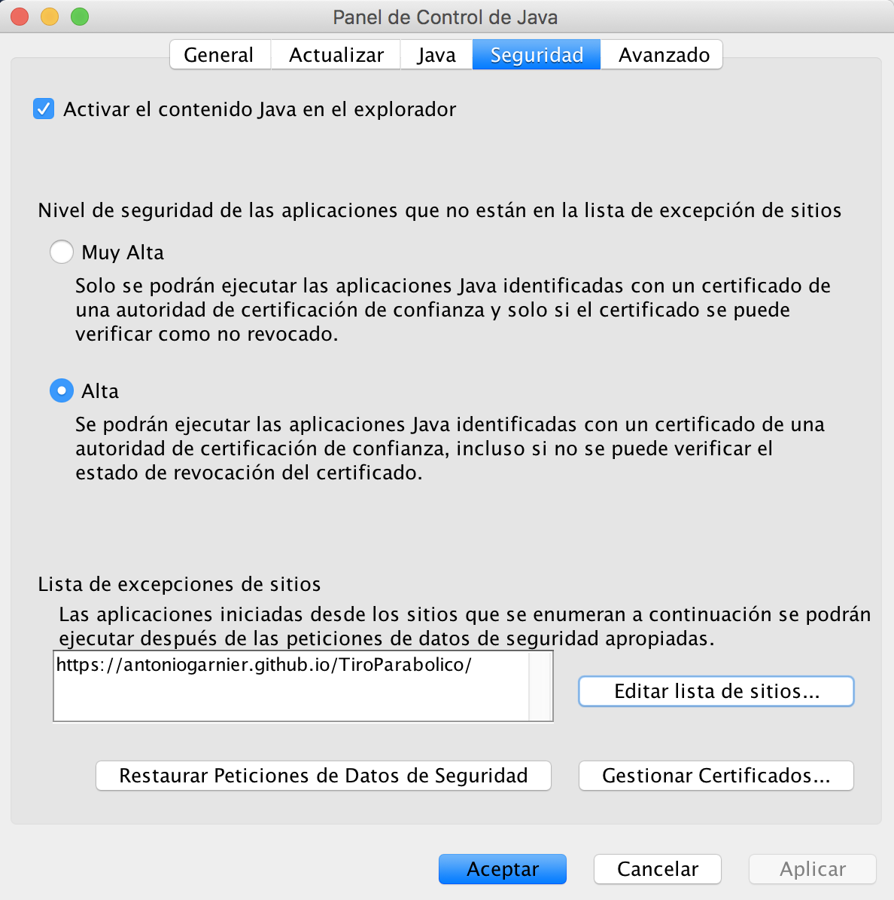

# Applets

   Lo primero que hay que hacer es entrar en el panel de configuración de java y añadir la página web donde esta alojada la applet a la lista de excepciones. Para ello hay que seguir los siguientes pasos.

## Panel de configuración de Java:

   1. Abrir el panel de configuración de java.
      * [Panel Java en Windows](https://www.java.com/es/download/help/win_controlpanel.xml).
      * [Panel Java Mac OS X](https://www.java.com/es/download/help/mac_controlpanel.xml).

   2. Ir a la pestaña de seguridad.
   3. Marcar la opción **"Activar el contenido Java en el explorador"**.
   4. Añadir a la **"Lista de excepciones de sitios"** la url donde esta alojada la applet.

   

## Visualizacion de la applet.

### Safari

   En safari es posible visualizar la applet solo con seguir los pasos anteriores.

### Para cualquier navegador.

   Tienes que tener java instalado. Con esto, existen dos opciones:
   1. Descargar el fichero con extension .jnlp y ejecutarlo.
   2. Utilizar el comando **javaws url_jnlp**. Ejemplo:
   
            javaws https://antoniogarnier.github.io/TiroParabolico/public/tiro.jnlp

   El fichero en formato .jnlp no es peligroso, aunque el navegador te lo indique como tal. No es más que un fichero **xml** con extension **jnlp**. [Aquí puedes ver un ejemplo](public/README.md).

   Con esto se ejecutaría la applet.

   **Nota Importante:** Esto funciona tanto para Applets como para aplicaciones standalone. Es lo bueno de [Java Web Start](https://www.java.com/es/download/faq/java_webstart.xml).
